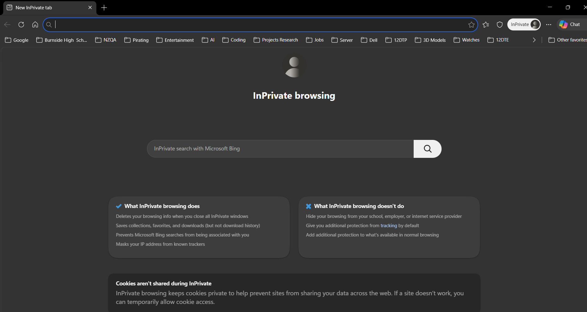
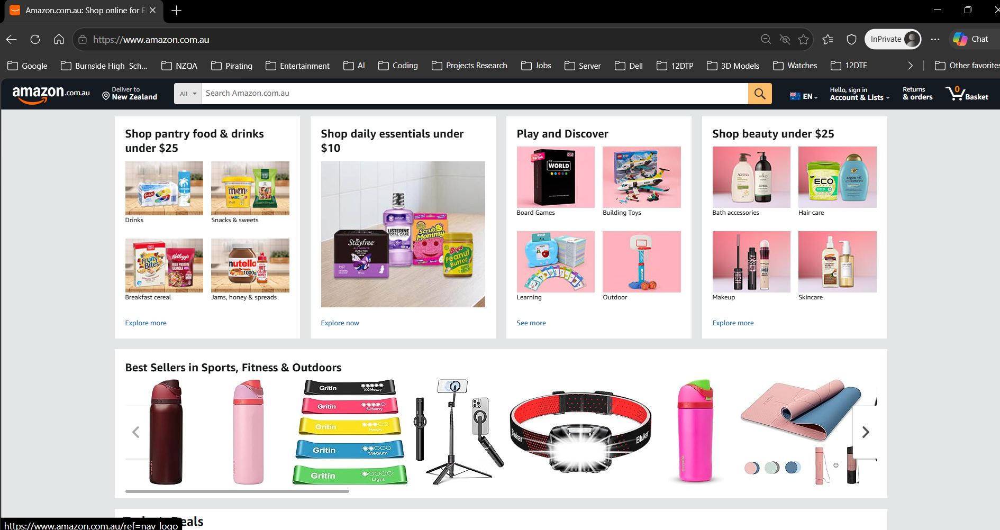
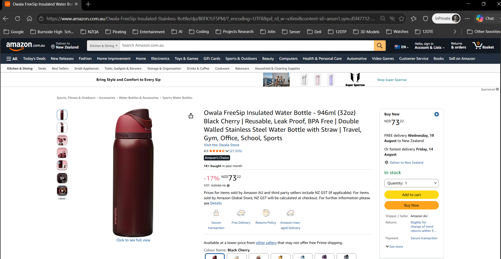
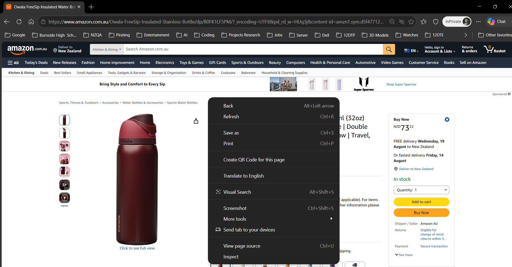
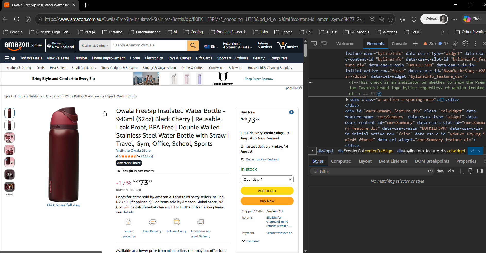
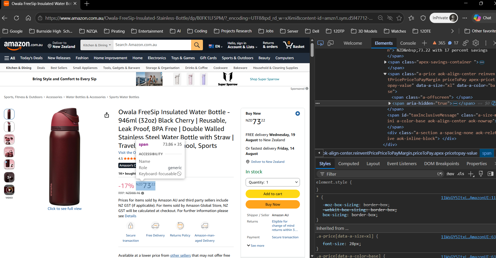
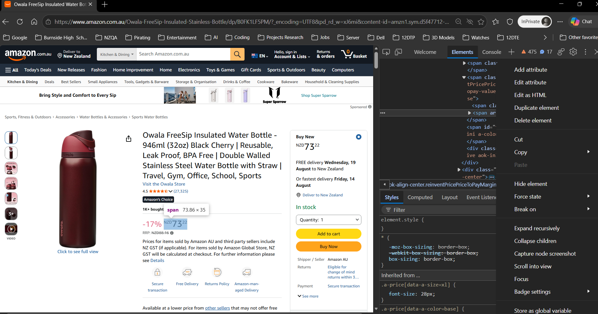
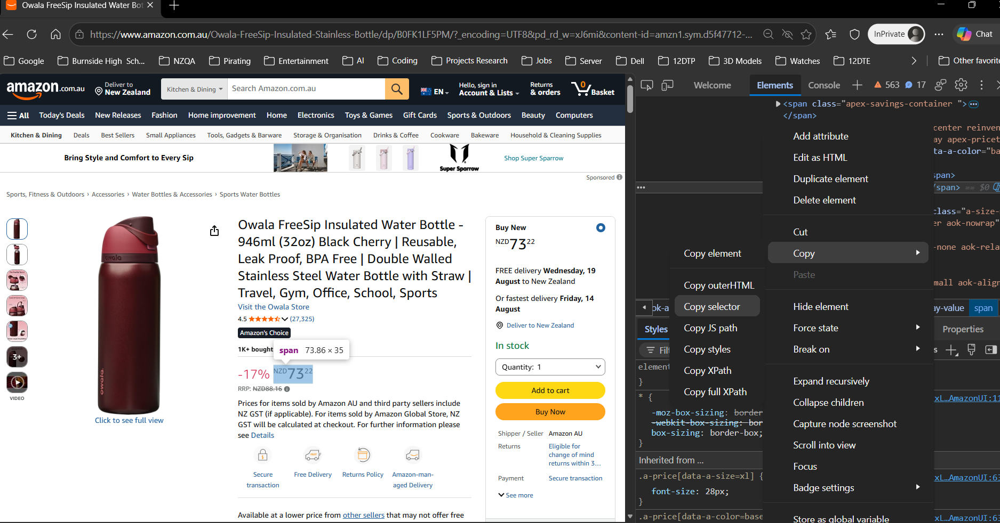
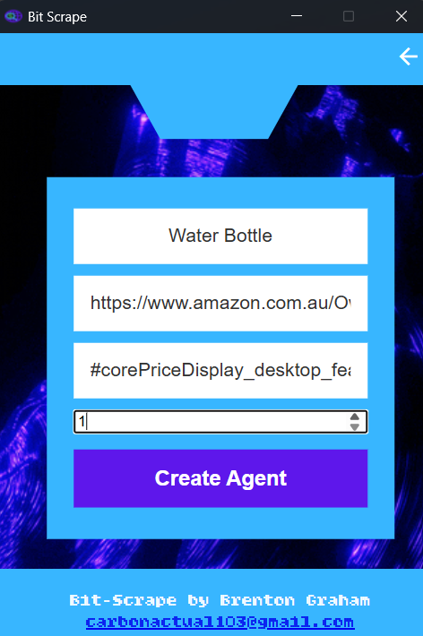

# Bit Scrape

Bit Scrape is a desktop web-scraping app built with **Flask** and **pywebview**. It lets you create "scraper agents" that watch a specific element on a webpage (like a product price) at a set interval, log every value it sees, and email you when the value changes.

## Download

- **Download the standalone app** _ The link below will direct you to the google drive where you can download the standalone app from
    https://drive.google.com/drive/folders/1WntA-KzPkmsmQVPjeA6BybWKyJfPMFJE?usp=drive_link

## Features

- **User accounts** – sign up, log in, and update your username/password/email
- **Scraper agents** – for each agent you define:
  - A name
  - A target webpage URL
  - A CSS selector for the element to watch
  - A scrape interval
- **Automated background scraping** – each agent runs in its own background thread using Playwright, checking the page on a loop and screenshotting the target page for confirmation
- **Change detection & email alerts** – when a scraped value differs from the previous one, Bit Scrape emails the user via Gmail SMTP
- **Scrape history** – every scrape result is timestamped and stored in the database
- **Native desktop window** – the Flask app is wrapped in a `pywebview` window (EdgeChromium), so it runs like a standalone app rather than in a browser tab

## Tech Stack

| Layer | Tool |
|---|---|
| Backend | Flask |
| Desktop shell | pywebview |
| Database | SQLite |
| Scraping | Playwright (via an `invisible_playwright` wrapper) |
| Auth | Werkzeug password hashing + Flask sessions |
| Email | `smtplib` (Gmail SMTP + App Password) |
| Images | Pillow |
| Config | `python-dotenv` |
| Frontend | HTML / CSS (Jinja templates) |

## Project Structure

```
Bit-Scrape/
├── backend.py        # Flask app, routes, scraping + email automation
├── database.db        # SQLite database
├── templates/          # Jinja HTML templates (login, home, agent config, etc.)
└── static/               # CSS, images, and other static assets
```

## Using BitScrape via the .exe

The app has also been packaged into an .exe with pyinstaller
    - Install the .zip file of the entire project
    - Extract it all
    - The .exe can be found at executable/dist/BitScrape.exe
    - Run the .exe and use the app

## How It Works

1. **Sign up / log in** – credentials are stored in the `user` table, passwords are hashed with Werkzeug.
2. **Create an agent** – provide a page URL, a CSS selector for the element you want to track, and a scrape interval. Bit Scrape opens the page with Playwright, grabs a screenshot for confirmation, and records the initial value.
3. **Background monitoring** – each agent runs in its own daemon thread, re-scraping the page on the configured interval and storing every result in the `scrapeData` table.
4. **Change alerts** – whenever the newly scraped value differs from the last recorded one, an email is sent to the account's registered address.
5. **Manage agents** – rename, reconfigure, or delete agents from the home screen; deleting a user removes their agents and scrape history too.

## How to setup an agent (Retrieving the element selector)

1. Open an incognito browser
    - This is just so a clean new browser is used
    
2. Go to the website that you wish to scrap from
    - Try to avoid websites with bot detection but it can still be hit or miss with any website as this app has not been fully tested
    - Amazon is recommended as it has been tested and has many products
    - If a website has a specific website for your country then make sure to use that one
    - Be sure to set the correct currency too, this is usually saved in the web site link
    
3. Find the item you would like to monitor and click on that item
    - This can be any item of your choice
    
4. Right click somewhere blank on the page
    - You need to bring up the page options
    
5. Click inspect to open up the page details and click the element selector
    - The element selector should be tothe topleft of the page details or just press ctrl+shift+c
    
6. After clicking on the element selector, select the elemnt you would like to scrape/monitor (e.g. price)
    - Try and include the whole price, including the currency symbol (e.g. NZD73.22)
    - After clicking the element, the page details should go straight to the html line of code for that element
    
7. Right click the html line of code for the element
    - It should bring up some options similiar to step 4
    
8. Copy the element selector
    - Click the copy option and then click 'copy selector'
    
9. Paste that into the selector box when setting up an agent
    


## License

No license has been specified for this repository yet.
